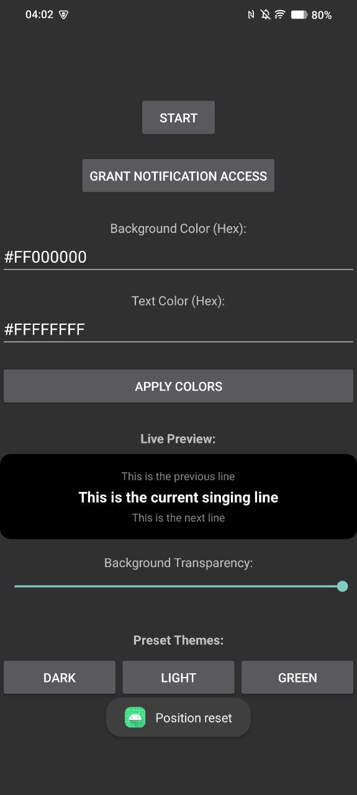
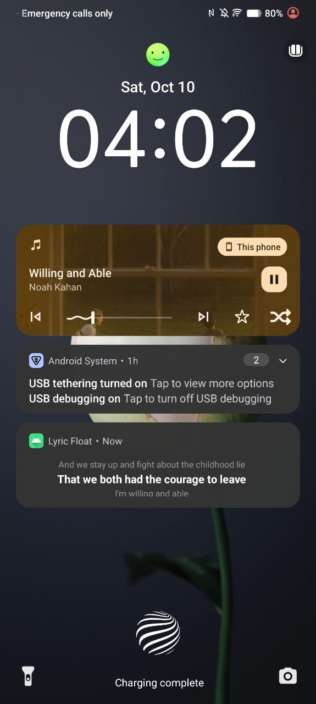
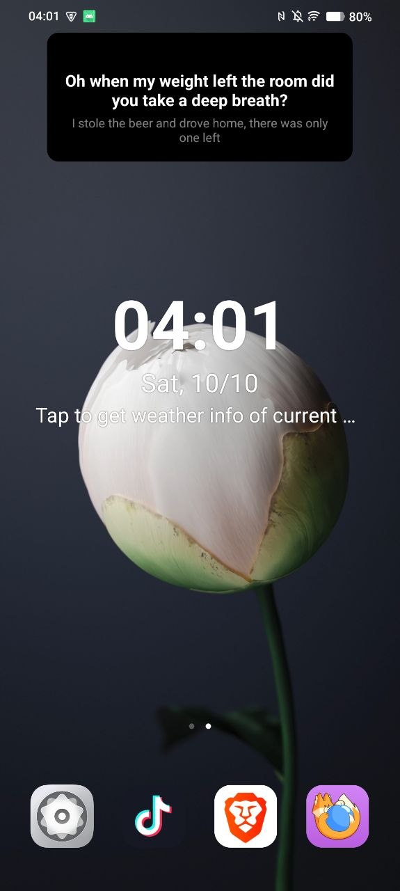
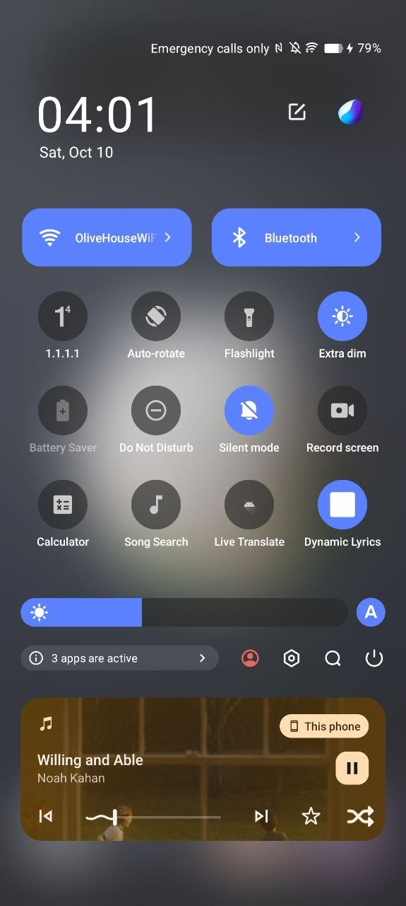
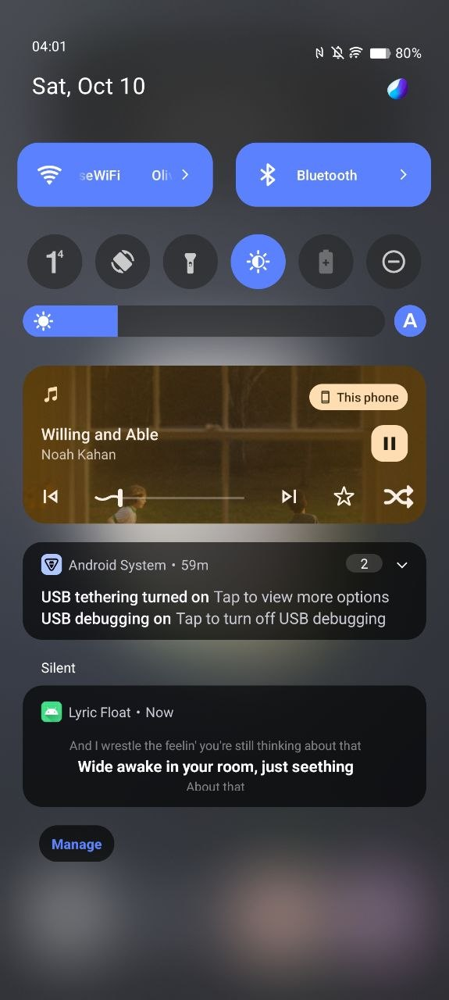

# Dynamic Lyrics

An Android app that displays real-time, time-synced lyrics in a floating window over active music apps, and seamlessly pushes an undismissable custom lyrics card directly to the lock screen. 

Built entirely with standard Android XML Views and Kotlin, Dynamic Lyrics leverages the free LRCLib API to provide instant, lightweight background synchronization without relying on heavy third-party UI libraries.

  
  
  
  
  

## 🌟 Features

* **Floating Overlay:** A compact, fixed-width (300dp) rolling lyrics window pinned to the top-center of the screen.
* **Lock Screen Integration:** Displays a customized, 3-line rolling lyrics notification on the lock screen beneath the system media player.
* **Instant Media Sync:** Automatically detects active track/artist changes via `NotificationListenerService` and syncs lyrics instantly in the background.
* **Live Theme Engine:** Customize the background hex color, text hex color, and transparency with a live real-time preview, saved via SharedPreferences.
* **Gesture Controls:** 
  * Double-tap the floating box to reset its position to the top-center.
  * Triple-tap to dismiss the service entirely.
* **Quick Settings Tile:** Toggle the service on/off directly from the Android control panel.

## 🛠 Tech Stack

* **Language:** Kotlin
* **UI:** Standard Android XML / RemoteViews (for custom notifications)
* **Asynchronous Operations:** Kotlin Coroutines (`Dispatchers.IO` for API calls, `Dispatchers.Main` for UI sync)
* **Lyrics Source:** [LRCLib API](https://lrclib.net/) (Network calls parsed from JSON to standard LRC timecodes)

## 🏗 Architecture & Developer Notes

If you are contributing to or forking this project, please note the following Android OS limitations and workarounds implemented in this codebase:

* **The 64dp Lock Screen Limit:** Modern Android OS strictly limits unexpanded lock screen notifications to a maximum height of 64dp. The custom layout (`layout_notification_lyrics.xml`) avoids cropping by hardcoding this exact height and utilizing `android:maxLines="1"` with `ellipsize="end"` to maintain the clean 3-line rolling effect without breaking the layout.
* **Background Execution Limits:** To prevent the OS from killing the lyrics engine while the app is in the background or the screen is locked, `FloatingLyricsService` is promoted to a Foreground Service using the `mediaPlayback` type and `PRIORITY_MAX` / `CATEGORY_STATUS` notification flags.
* **Media Listener Separation:** The app relies on `NotificationListenerService` to capture metadata (Track/Artist) from other music apps. This is intentionally separated from the UI/Overlay service to prevent race conditions when launching from the Quick Settings Tile.
* **Broadcasts:** Internal communication (updating lyrics, changing custom colors instantly) is handled via internal `BroadcastReceiver` configurations with `RECEIVER_NOT_EXPORTED` flags for security.

## 🔐 Required Permissions

The app requests the following system permissions to function:
* `SYSTEM_ALERT_WINDOW` (To draw the floating overlay)
* `ACTION_NOTIFICATION_LISTENER_SETTINGS` (To read current media playback)
* `POST_NOTIFICATIONS` (To display the lock screen lyrics card)
* `FOREGROUND_SERVICE` & `FOREGROUND_SERVICE_MEDIA_PLAYBACK` (To run the background sync loop)
* `INTERNET` (To query LRCLib)

## 🚀 How to Build

1. Clone this repository.
2. Open the project in Android Studio.
3. Allow Gradle to sync the dependencies.
4. Build and run directly to your emulator or physical device.
